# Adafruit Feather CO2 Meter

A simple, small, handheld carbon dioxide meter, temperature meter, and humidity meter built with an Adafruit RP2040, a 2.9" eInk display, a SCD-40 CO2 sensor, and CircuitPython 7.


2021 onwards saw a surge of people using CO2 meters to help gauge indoor air quality. I feel like I saw the [Aranet4](https://aranet.com/products/aranet4/) a lot but on Twitter I saw people making their own and thought "that's a fun project, I'll do it too!"  

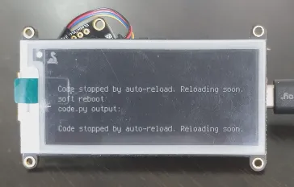

*It's battery powered!*


## Components

| Item                                                                                        | Cost (USD) |
| ------------------------------------------------------------------------------------------- | ---------: |
| [Feather RP2040](https://www.adafruit.com/product/4884)                                     |     $11.95 |
| [Adafruit 2.9" Grayscale eInk](https://www.adafruit.com/product/4777)                       |     $22.50 |
| [Lithium Ion Polymer Battery 400mAh](https://www.adafruit.com/product/3898)                 |      $6.95 |
| [SCD-40 - True CO2, Temperature and Humidity Sensor](https://www.adafruit.com/product/5187) |     $49.50 |
| [STEMMA QT / Qwiic JST SH 4-pin Cable](https://www.adafruit.com/product/4210)               |      $0.95 |
| [Brass M2.5 Standoffs 16mm tall](https://www.adafruit.com/product/2337)                     |      $1.25 |
| Total                                                                                       |     $93.10 |

The only soldering needed is to attach the given headers onto the RP2040.

## How to use this repository

### Tutorials
The Tutorials folder contains lift and shift code to do the exact same steps I did. They include the correct binaries too so it just works straight away. There's also a readme there to go over what each of the folders contain.

### Running the code
Assuming you have all the components above, the src folder has all you need to lift and shift the code and binaries to your Feather.

## Development

Project milestones.

### Blink LED

First up is a hello world. Originally I followed this [Blink tutorial](https://learn.adafruit.com/adafruit-feather-rp2040-pico/blink) to get off the ground. It worked straight away and it was the cleaest code of this project - it's all downhill from here.

### Running display

I hadn't soldered for a long time and it showed when I tried to solder the header pins to the Feather RP2040 they were WONKY. Below is an artist's rendition of what the pins looked like before correcting:

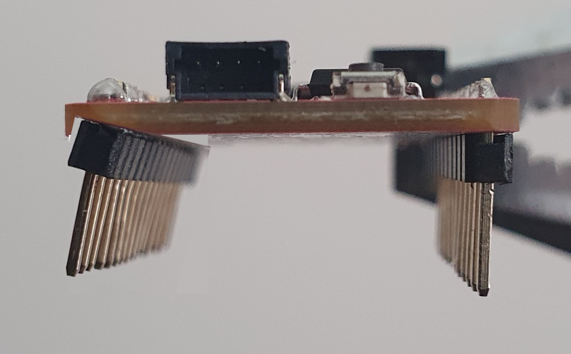

Then when I finally got them to line up and ran the example code from Adafruit...


To which I realised I was running the entirely wrong code. I copied the code for a different eInk display 🤦‍♀️

Once I sorted out the very basics of reading comprehension, I got to the two main goals of this stage:
1. Get text on screen
1. Get shapes on screen

The example of shapes:

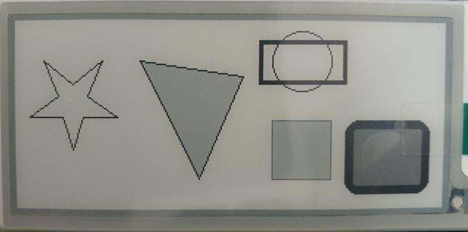

Why shapes? Because I had a design in mind for the first stable release of different areas on screen representing the different data from the sensor, and rectangles can be what makes the areas obvious.

### Getting CO2 values

Taking the sample code for it was easy and it showed up exactly as expected in the Mu editor serial output window.
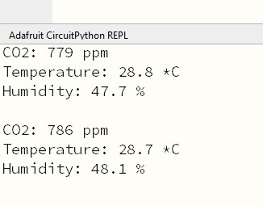

### Proof of concept

I need two things:
1. Get the readings
1. Throw them on screen

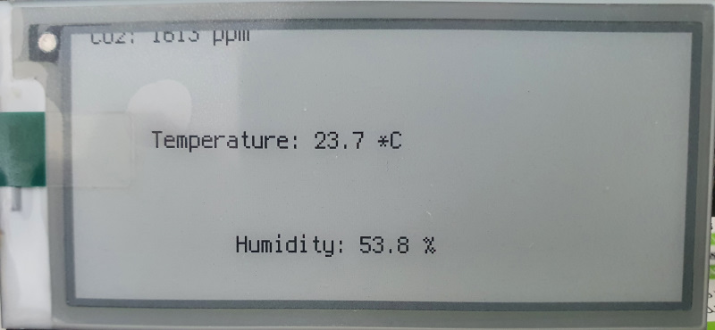

### First Stable release

Taking the previous milestone and making it presentable. This pulls together all the previous work.

| Position | Image                 |
| -------- | --------------------- |
| Front    |  |
| Top      | 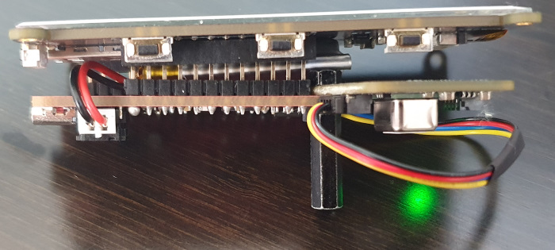   |
| Back     | 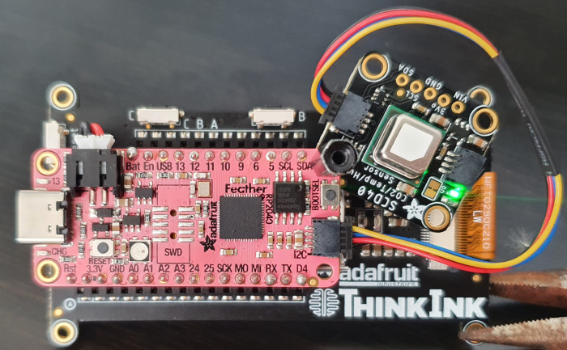  |
| Left     | 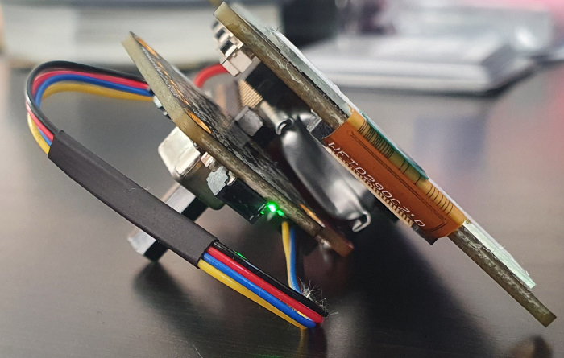  |
| Right    | 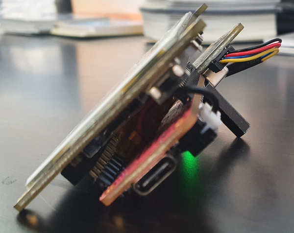 |

Used a single spacer to both hold the sensor to the RP2040 and as a makeshift kickstand for the back. It works pretty well!

And for a preview of other CO2 ratings with expert photography:

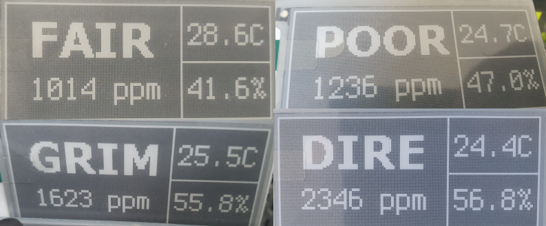

### Power efficiency Improvements

#### Power saving with a deep sleep


The 400mAh battery lasts (very) approximately 12 hours with the first stable release and I think it can do far better. But first, let's understand the power usage patterns. I'll be using a [Multifunctional USB Digital Tester - USB A and C](https://www.adafruit.com/product/4232) to get the readings.

| Scenario   | Description                                                                   | Reading     | Notes                                                                           |
| ---------- | ----------------------------------------------------------------------------- | ----------- | ------------------------------------------------------------------------------- |
| Baseline 1 | Blinking LED, nothing attached                                                | 0.21W-0.23W | Our absolute baseline                                                           |
| Baseline 2 | Blinking LED, display attached (nothing displaying)                           | 0.21W-0.23W |                                                                                 |
| Baseline 3 | Blinking LED, display attached (nothing displaying), SCD-40 (nothing reading) | 0.21W-0.25W |                                                                                 |
| Baseline 4 | Stable release code                                                           | 0.23W-0.74W | Big spikes (more on that below), otherwise about the same as previous scenarios |

Now that we have baseline measurements, it's time to optimise! 

Let's deal with the easy stuff: Busy waits. I love optimising things (self plug: [Shrinking a Self-Contained .NET 6 Wordle-Clone Executable](https://www.nikouusitalo.com/blog/shrinking-a-self-contained-net-6-wordle-clone-executable/)) and there's a whole heap of ways for programs to sleep across different languages. I suspect that in CircuitPython that the `time.sleep()` call might be a bit busy in the background. Doing some digging, it turns out we can use alarms instead of sleeps. I picked up on this fantastic tutorial called [Deep Sleep with CircuitPython](https://learn.adafruit.com/deep-sleep-with-circuitpython/alarms-and-sleep) which explained the different types of sleep in CircuitPython. 

I ran some tests (which are in the Tutorials/DeepSleep folder) for deep sleeps. The test case was a blink based on the tutorial and here are the results:

| Scenario | Description                                | Reading     | Notes                                                                                                                  |
| -------- | ------------------------------------------ | ----------- | ---------------------------------------------------------------------------------------------------------------------- |
| Sleep 1  | `time.sleep()`                             | 0.21W-0.23W | This one is in the Blink folder                                                                                        |
| Sleep 2  | `alarm.light_sleep_until_alarms()`         | 0.17W-0.25W | But more often around 0.17W-0.23W                                                                                      |
| Sleep 3  | `alarm.exit_and_deep_sleep_until_alarms()` | 0.11W-0.23W | Both: <ol><li>I did see it hit 0W a couple of times</li><li>The RGB NeoPixel also fires due to it booting up</li></ol> |

*Note: Test when connected to a power supply, and not PC as the board will not actively sleep when connected to a host computer.*

The deep sleep looks like what we want. So let's apply it to the stable release:
| Scenario     | Description                                        | Reading     | Notes                                                              |
| ------------ | -------------------------------------------------- | ----------- | ------------------------------------------------------------------ |
| Efficiency 1 | Stable release code with improved power efficiency | 0.13W-0.64W | A good improvement but with the same big spikes (see further down) |

A 0.1W drop and the spikes remain.

The readings from the digital tester with some back of the envelope maths, the battery should last around 8 hours and 10 minutes.

#### Power saving by turning off the sensor

Spike time. Every 3-5 seconds as it seems the SCD-40 sensor does a reading regardless of whether the values will be read or not. Below is a quick look at the meter, note the red wattage reading on the lower left and how it spikes:

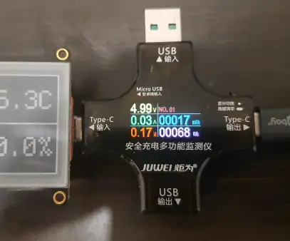

*Note: The display on the reader presents averages between updates. It may not show the proper spike on each display update due to this.*

Notice that these spikes did not happen in scenario Baseline 3 even with the sensor connected - it only started happening in Baseline 4 when the sensor has been activated. We can prove this by using the same blink code as Baseline 1, but added in the start measurement code for the sensor from Baseline 4: 

```python
import time
import alarm
import board
import digitalio
import adafruit_scd4x

led = digitalio.DigitalInOut(board.LED)
led.direction = digitalio.Direction.OUTPUT

i2c = board.I2C()
scd4x = adafruit_scd4x.SCD4X(i2c)
scd4x.start_periodic_measurement()

while True:
    led.value = True
    time.sleep(1)
    led.value = False

    time.sleep(3)
```

| Scenario   | Description                                         | Reading     | Notes |
| ---------- | --------------------------------------------------- | ----------- | ----- |
| Baseline 5 | Blinking LED, no display attached, SCD-40 activated | 0.23W-0.71W |       |

Nailed it. Confirmed that the sensor measurements need to be kicked off before we see the power usage spikes. 

In theory if there is a start then there should be a stop. And there is! [`stop_periodic_measurement()`](https://docs.circuitpython.org/projects/scd4x/en/latest/api.html#adafruit_scd4x.SCD4X.stop_periodic_measurement) is the exact call we're looking for. So the code will now:

1. Only start a measurement just before needing the value
1. Read and store the result
1. Immediately stop the measurement

Let's see what that looks like:

| Scenario     | Description                        | Reading     | Notes                                                                 |
| ------------ | ---------------------------------- | ----------- | --------------------------------------------------------------------- |
| Efficiency 2 | Efficiency 1 + power spike removal | 0.11W-0.15W | Then with the spike to 0.71W at the 5 minute mark to do a single read |

The readings from the digital tester with some back of the envelope maths, the battery should last around 12 hours and 40 minutes.