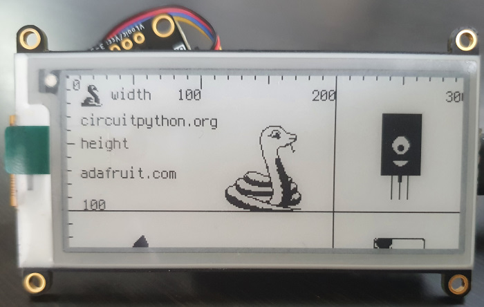
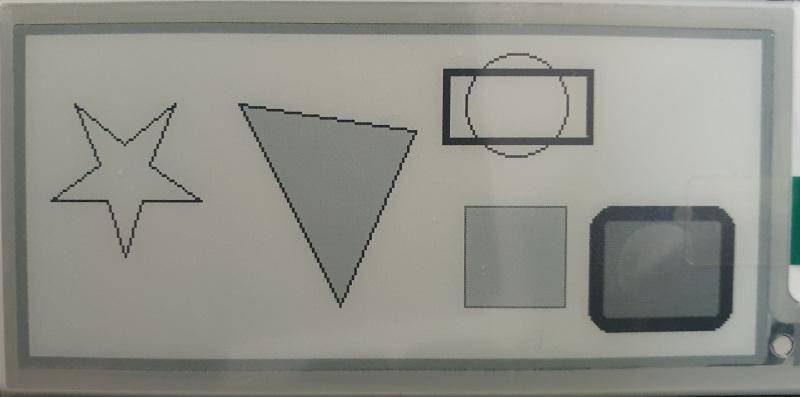
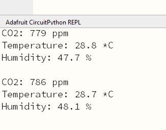

# Tutorials

These tutorials mostly adapted from the brilliant [Adafruit CircuitPython Bundle repo](https://github.com/adafruit/Adafruit_CircuitPython_Bundle). They're designed in a way you can just copy the contents and paste right into your `CIRCUITPY` drive as they contain the correct libraries and code to run straight away. (Assuming you're using the same setup as me with an RP2040, CircuitPython 7, and a 2.9" greyscale eInk display)

**The below is in the order I took learning about CircuitPython.**

## Blink (Hello world)
Blinks the red LED (not the RGB NeoPixel).

## DisplayImage
The basic image display tutorial to present an unscaled image on the display.

## DisplayGradient
Displays a white to black grey gradient image to show off how it gets transformed into the 4 different monochrome colour blocks.

## DisplayText
Displays "Hello World!" on the display.

## DisplayTextDifferentFont
Displays "Hello World!" on the display with an imported font.

## DrawShape
Draws shapes including fill, outline colour, and outline thickness.

## PrintCO2
Prints the CO2 PPM, temperature, and humidity to the serial output (print statements).

## DeepSleep
Two examples of using alarms for deeper sleeps compared to `time.sleep()`.